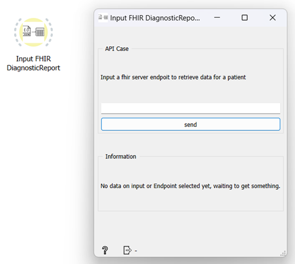
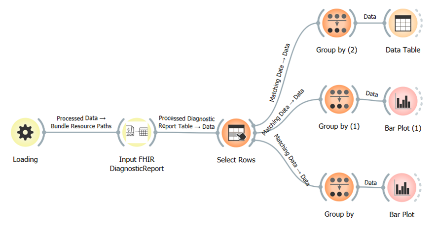
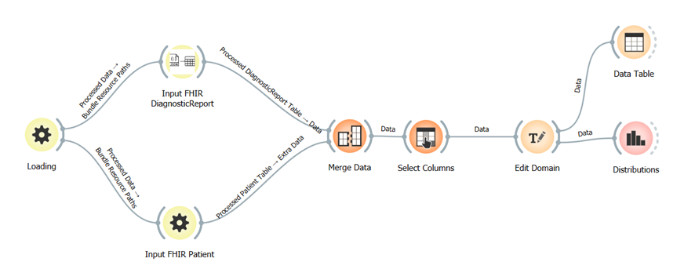

# ORANGE / FHIR - Implementation DiagnosticReport Resource

Implementation of  [Orange Data Mining](https://orangedatamining.com/) widget of [DiagnosticReport](https://build.fhir.org/diagnosticreport.html) resource from [FHIR](https://fhir.org/) standard via Python

## Interface

Components: 
- API Case: this case is specific for making a request via API (Ex: https://spark.incendi.no/fhir/DiagnosticReport/:id) and activating all the previous functionality. It will only be available if you do not upload the widget via file first
- Information: shows information relevant to all developed cases as well as the various possible errors
Then, this widget accepts input and output, defined as:
- Input: accepts the list of file paths coming from the Loading widget
- Output: returns a Data Table with the processed information

## Code
Divided in: 
1. Data Loading: consists of obtaining and importing data from various sources. In the case of development from the Orange Widget with the DiagnosticReport resource, we have two different types of data loading:
- Via API
- Synthea JSON file selections

2. Data Cleaning: receive a dataframe with all the raw data from the previous step and created a new, clean dataframe, which contains the following information:
- ResourceID: Unique identifier for DiagnosticReport resources
- LOINC Code A: if available, standard number/code that identifies the medical laboratory test, taken from the site https://loinc.org/
- LOINC Diagnostic A: if available, description of the laboratory test
- LOINC Code B: same as LOINC Code A, but sometimes more than one laboratory test code is found
- LOINC Diagnostic B: same as LOINC Diagnostic A, but sometimes more than one laboratory test code is found
- DiagnosticDate: date of the report
- Doctor: name of the doctor who made the diagnosis
- Test: test carried out and identifying
- Result: results obtained from the test
- PatientReference: patient / subject in which the reports are made
- EncounterReference: identifier on the Encounter resource made
One thing to note, and that in the case of this resource, we only have categorical or string data types.

3. Data Visualization: for the visualization inside Orange in which it is mandatory to send in a tabular form (Data Table), the commit_table function has been developed, which has the construct_domain function inside.
In the case of construct_domain, we separate the dataframe into its dtypes, to then see the data type for each column. Then, the data types required by Orange are assigned based on that of the source to return the Domain needed to build the Orange table.
Finally, within commit_table, we proceed to build the Orange table with the domain received from the construct_domain function and the values of the final dataframe to be able to display the Data Table in the correct form within the Orange UI.

## Workflows Emaples
1. General distribution of DiagnosticReport with file entry:

2. Merge of results between DiagnosticReport and Patient:
